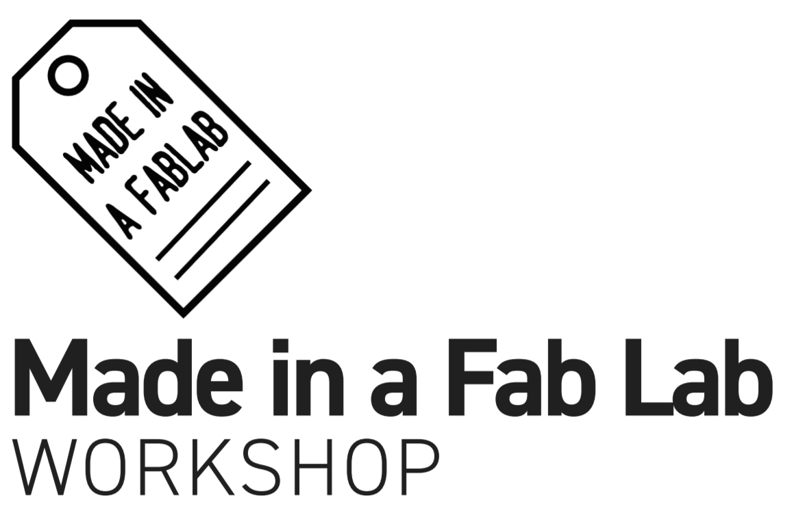

This manual provides guidelines and references for instructors about the
projects covered in the Made in a Fab Lab workshop.

###[Documentation](documentation.md)

Participants should fill in the provided [template](documentation.md). This details all the steps needed to completely document a project, both internally and externally.

### [Project briefs](project_briefs.md)

Cards describing Made in a Fab Lab inspirational projects and ideas for building products around them.

