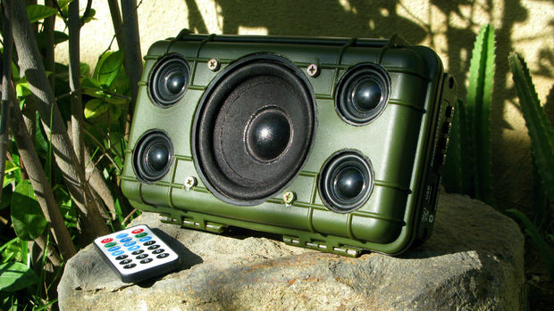
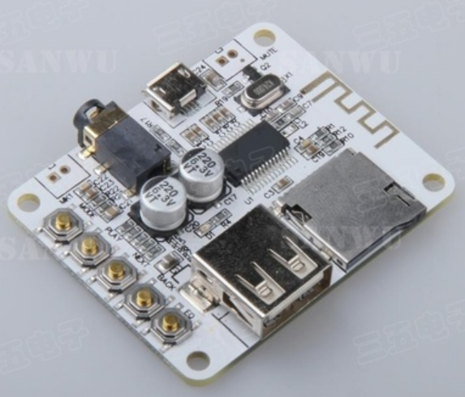
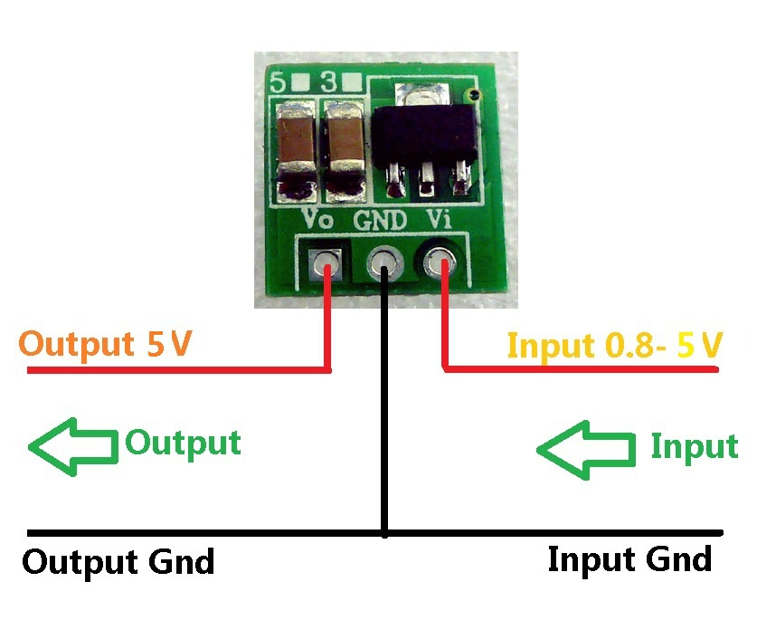
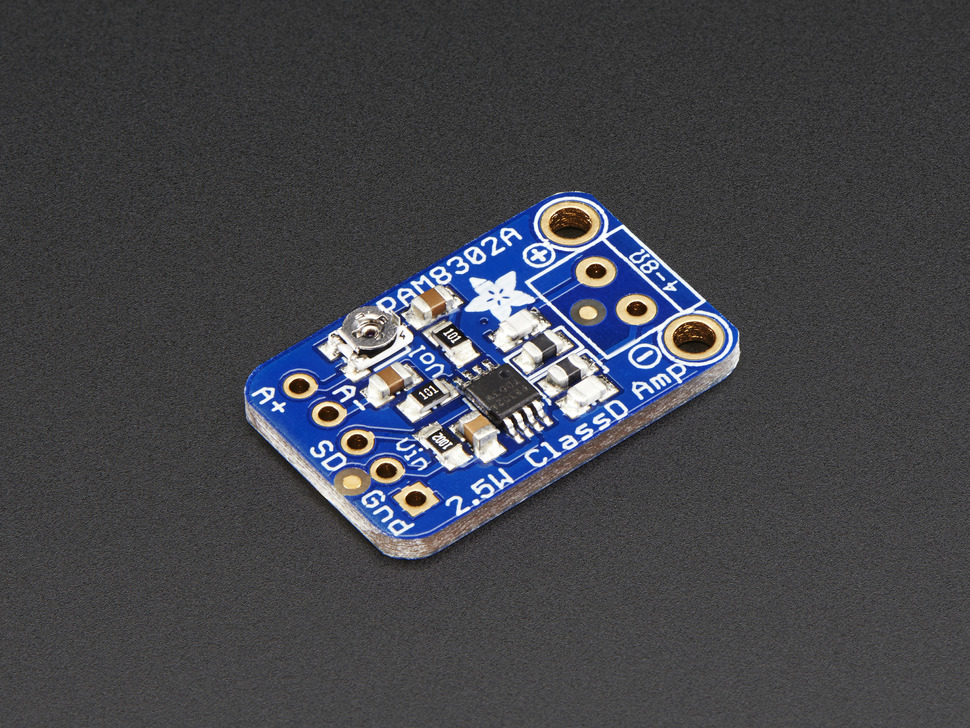
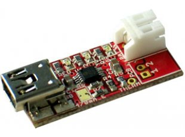
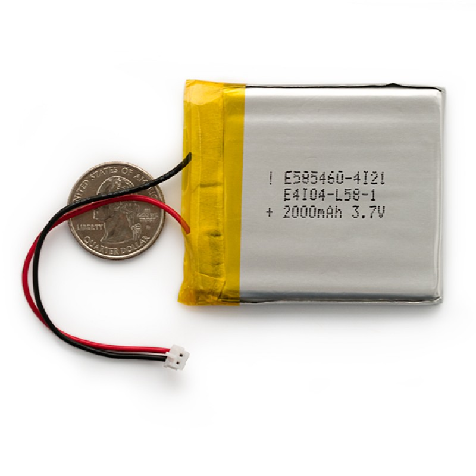
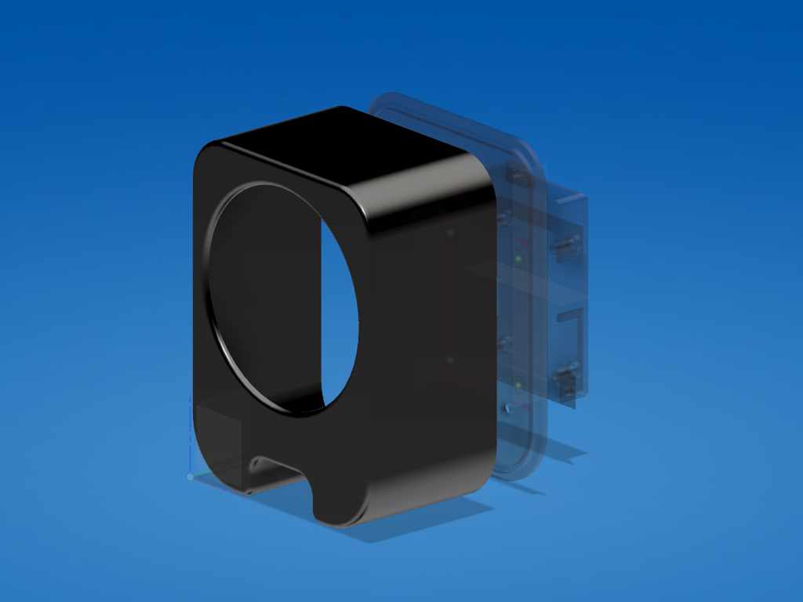

## BLUETOOTH MP3 SPEAKER 

The company is looking for a innovative mp3 / bluetooth speaker which can be easily produced using injection molding processes with different materials, composed of two or more different pieces, in order to minimize part complexity.
The product designer must design and prototype their concept proposal based on the preliminary CAD files provided.

The project should include the product concept statement and its documentation in order to easily replicate the product in any lab.

### PRODUCT REQUIREMENTS

	
- Dimensions: 80x80x25mm maximum 
- Low part complexity
- Include space for electronics, battery and wiring
- Allow to insert an SD-card
- Provision for recharging the battery
- Simple button / LED interface 

### MACHINES AND TOOLS

- 3D printer
- Laser cutter
- Precision CNC Mill, i.e. Roland SRM-20 
- Soldering iron

### BILL OF MATERIALS

- Bluetooth / MP3 board (ready-made)
- 3W Mono / Stereo Amplifier board
- Step-up 5V board
- Lipo Charger
- Speaker panels
- Lipo battery
- Control panel
- Buttons
- Resistors
- LEDs

### Building instructions

#### Parts detail

The speaker operates thanks to a Bluetooth Board, which contains all the wireless and audio processing code in hardware.

<table>
  <tr>
    <td colspan=2>
      

          Bluetooth board
      

    </td>
  </tr>
</table>

The board can be powered via the micro USB port, or a LiPo Battery can be used along with a step-up converter, bringing the LiPo 3.7v to 5v.

In order to power the speaker is possible to use the same 5v (or output taken from the Bluetooth Board USB) for a small class-d amplifier and 3W speakers.

To be able to recharge the battery you need to add a LiPo Charger, which switches power sources when a connector is plugged.

<table>
  <tr>
    <td>
      

         5V Step-up converter
      

    </td>
    <td>
      

         Class D Amplifier
      

    </td>
  </tr>
  <tr>
    <td>
      

         USB Lipo Charger
      

    </td>
    <td>
      

         Lipo Battery
      

    </td>
  </tr>
</table>

#### Wiring

Based on the speaker and amplifier power requirements you will need to select a suitable LiPo battery with enough Amps to last for some time. We recommend to use at least a 2A battery.

- Connect the step-up 5V board to the Amplifier and Bluetooth board, using wires to hook up V and Ground. You can solder wires directly on the USB connector pins.

- Connect the Lipo Battery to the Charger, and run wires from the Charger to the step up board

- Connect the speakers + and - to the amplifier

- Build a case around the speaker, you will need to leave ports for connecting the micro USB cable

- Optionally you can expose the boards buttons and SD Card slot so you can access the MP3 player functionality. To do so, add buttons to the enclosure and run wires to the original buttons pads. Solder them to replicate the board button functionality.

- Same applies to the power LEDs. You can either run wires to the USB connector (remember to add a 1K resistor on one wire) or to the on-board LED indicators (in this case no need to use a resistor)

#### Enclosure

The speaker must be encapsulated in a suitable enclosure. 

The following options can be proposed to participants:

- 3D Printed enclosure: You can find models for 3D printing in the shared Fusion 360 Archive BluetoothMP3 Folder, and at the following url: http://a360.co/2iW1Y79

- Laser-cut enclosure: participants can design a basic box using the [Box Designer](http://boxdesigner.connectionlab.org/) software, then edit the output for creating slots for the electronics and speaker

- Recycled - upcycled enclosure. Any metal box can be customized using hand-tools to fit the speaker. Some examples are old suitcases, ammunition boxes, old telephones, and even Springles cans. For examples and inspiration see: [DIY Bluetooth Speaker on Pinterest](https://it.pinterest.com/search/pins/?q=Bluetooth%20Speakers%20diy&rs=typed&term_meta[]=Bluetooth%7Ctyped&term_meta[]=Speakers%7Ctyped&term_meta[]=diy%7Ctyped)

