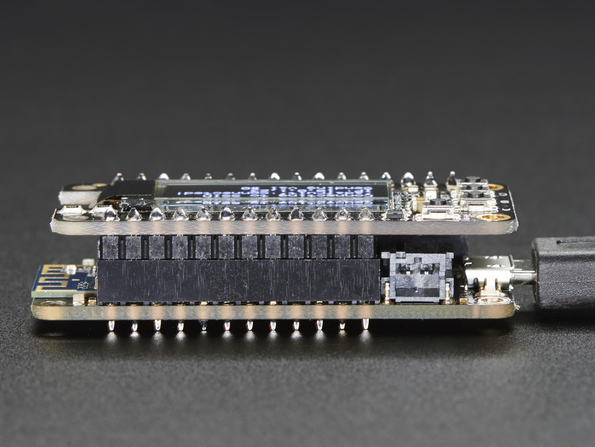

## BRIGHT JEWEL


The Jewellery Company Leader Delta is looking for an innovative and atypical jewel in order to launch a new collection of bright jewels suitable for males and females.
The product can be an innovative ring, a bracelet, a necklace but also an accessory.

There is no limit to the shape and the size of the jewel. 
It should only embed the electronics and emit light with a programmable pattern.
Particular attention should be paid to the aesthetics and materials of the proposed design concept. 

Designer should develop and prototype their jewel proposal using digital fabrication technologies. We recommend to prototype the product using or combining 3D printing and molding and casting processes.

The project should include the product concept statement and its documentation in order to easily replicate the product in any lab.


### PRODUCT REQUIREMENTS
	
- Easily replicable in any lab in maximum 4 hours
- Suitable for male and female
- Fancy lighting effects
- Elegant materials

### MACHINES AND TOOLS
	
- 3D Printer
- Laser cutter
- Precision CNC Mill, i.e. Roland SRM-20 
- Soldering iron


### BILL OF MATERIALS

- [Adafruit Feather w/ ATMega 328p](https://www.adafruit.com/product/2771)
- Adafruit Feather Wing with charlie-plexed LEDs
- LIPO battery
- Push-Buttons
- Silicone for molding
- Resin for casting
- Machinable wax


### Build instructions

The project is composed by two modules:

- Electronics boards + LED array and LiPo Battery

- Enclosure and pendant: this could be a 3D Printed Case, a Laser Cut box, or a molded container

### Assembling the Electronics

The two boards are made to be stacked on top of each other. Before that you must solder the headers to the Feather. For minimum size it's better to use the [low profile headers kit](https://www.adafruit.com/product/2940)

Stack the Feather Wing on top of the Feather and connect the LiPo Battery to the Feather.





### Programming

** Preparation **

Add Adafruit AVR Boards to the Arduino IDE like shown in the previous projects.

Add the required libraries:

- [Adafruit_IS31FL3731](https://github.com/adafruit/Adafruit_IS31FL3731/archive/master.zip)

- [Adafruit GFX](https://github.com/adafruit/Adafruit-GFX-Library/archive/master.zip)


Load the Demo sketch: File->Examples->Adafruit_IS31FL3731->featherswirldemo 

In order to work with the Charlieplexing FeatherWing uncomment  the second line so it look like the following:

```
// If you're using the full breakout...
//Adafruit_IS31FL3731 matrix = Adafruit_IS31FL3731();
// If you're using the FeatherWing version
Adafruit_IS31FL3731_Wing matrix = Adafruit_IS31FL3731_Wing();
```

**Exercise**

You can modify the sketch to draw any pattern or bitmap.

The library allows to do both with the ```drawPixel()``` and ```drawBitmap()``` functions. The Bitmap is stored into an array of bytes each representing a pixel. 

You can also regulate the intensity of each pixel using the ```setColor()``` function.

Finally the library allows to draw scrolling text using the ```print()``` function.

### Enclosure


A sample enclosure for making a pendant light jewel is provided in the [Fusion 360 Folder](http://a360.co/2j5Dokp).

You can 3D Print the two parts and use the pendant hole for covering the micro-usb port. 

> TIP: Make sure you print the top part with white ABS or transparent opaque filament like PETG. For best results use high layer height (.3mm) for achieving a frosted-like effect

For building other projects, a basic enclosure is also provided for the Adafruit Feather. Start from the [Fusion 360 design](http://a360.co/2nK42AQ).


