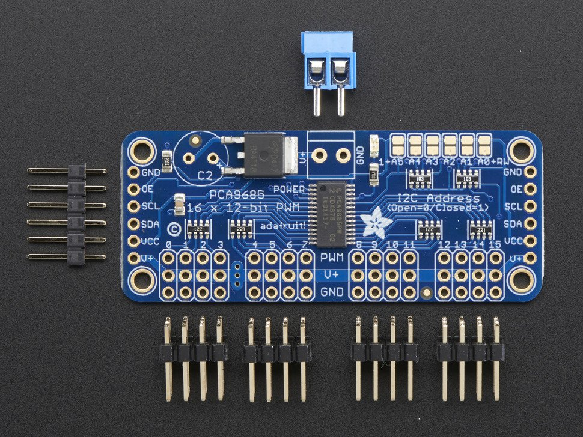

## DESKTOP ROBOTIC LAMP


Lampus Company is looking for a robotic desktop lamp which is able to play and draw using light.

We selected the uArm project as a basis in order to make a four-axis robot lamp which can easily move and light in multiple directions.

The lamp must be equipped with a lampshade, made of wood or plastics, and a solid base for embedding the electronics.

The final user should be able to select between different modes of operation using a simple interface. 

The design of the lamp should be parametric, based on the size of the robot, quantity of LEDs and material thickness.

The project should include the product concept statement and its documentation in order to easily replicate the product in any lab.

### PRODUCT REQUIREMENTS
	
- Easily replicable in any lab in maximum 4 hours
- Lampshade made of wood or plastics
- Interface for setting modes of operation
- Parametric model
- Fancy lighting effects

### MACHINES AND TOOLS

	
- 3D Printer
- Laser cutter
- Precision CNC Mill, i.e. Roland SRM-20 
- Soldering iron
	

### BILL OF MATERIALS

- Robotic Arm kit, for example [Sainsmart](https://www.sainsmart.com/collections/robotics-cnc/products/4-axis-desktop-robotic-arm-assembled)

- NeoPixel LED Strip

- Arduino-compatible board.

- Materials for the enclosure: PLA, ABS - or Natural fiber composite, Wood, Acrylic

- [Adafruit 16-Channel 12-bit PWM/Servo Driver - I2C interface - PCA9685](https://www.adafruit.com/product/815)

### Servo specs

**MG995 Servo:**
```
Size: 40.7*19.7*42.9mm     16*7.8*16.9 inch
Working torque: 13kg/cm
Respond rotation speed: 53-62R/M
Working temperature: -30~+60℃   -22℉~+140℉
Dead zone: 4ms
Plug: JR, Futaba
Rotation angle: 180 degree
Analog servo
Working current: 100mA
Working voltage: 3-7.2V
Metal gear, coreless motor, two ball bearing
Operation speed: 0.17s/60degree(4.8V); 0.13S/60degree(6.0V)
```

**SG90 Servo:**
```
Size: 23*12.2*29mm   0.9*0.5*1.1inch
Weight: 9g
Working torque: 1.6kg/cm
Respond rotation speed: 0.12-0.13s/60degree
Working temperature: -30~+60℃   -22℉~+140℉
Dead zone: 5ms
Plug: JR, Futaba
Rotation angle: 180 degree
Analog servo
Working current: 100mA
Working voltage: 3.5-6V
Metal gear
```

## Building instructions

The robot arm should come assembled. In any case the robot needs to be assembled before the workshop, so participants can focus on the design.

The robot arm comes with four wires, each for one of the servo motors controlling the arm movement.

You need to connect the servo motors with the servo driver board and the latter with the Arduino board, according to the following:

  1. Prepare the driver board soldering the pins.
  
  
  
  2. Connect the servo motors to the pins, starting from left (0) with the bottom servo connector, and moving from bottom to top in numbering them. Ground wire (usually black or brown) with the bottom row and the signal wire (usually yellow or white) on the top, and red in the middle.
  
  3. Connect the I2C wires from the driver board to Arduino
```
SCL -> SCL Arduino UNO (old Analog 5)
SDA -> SDA Arduino UNO (old Analog 4 )
GND -> GND
VCC -> 5V Arduino pin
```

  This will power only the board, not the servo.
  
  4. Connect power to the servo. You can use a 5V power supply, a 4xAA battery holder. Anything from 5V to 6-7v should be fine. Don't turn on power yet.
  
    
    
    
### Enclosure

<table>
<tr>
<td>
<p>
</td>
<td>
</p>
</td>
</tr>
</table>

You can find a design for the Enclosure in the Fusion 360 Shared folder, or at this link:

http://a360.co/2wBNvkb
    
    
### Programming

**Preparation**

You need to install the Adafruit PWM Servo Driver Library:

https://github.com/adafruit/Adafruit-PWM-Servo-Driver-Library

Start conecting only the servo number 0, to test the wiring.

**Calibration**

Loading the Servo Example  (File->Examples->Adafruit_PWMServoDriver->Servo)
in the board should make the servo move back and forth of 180 degrees.

Now you can do a calibration adjusting the numbers in SERVOMIN and SERVOMAX. Make small changes and test you cover all 180 degrees.

**Programming**

The Servo library uses pulse timing for operating the servo. Once calibration is done, you can use the following function to get the required pulse length from degrees:

```
pulselength = map(degrees, 0, 180, SERVOMIN, SERVOMAX);
```

You can also set the pulse frequency, the servos used in the project work well with 1ms.

```
pwm.setPWMFreq(1000)
```

Add to the Servo Example a function like the following:

```
void setServo(uint8_t n, uint8_t degrees){
  pwm.setPWM(n, 0,  map(degrees, 0, 180, SERVOMIN, SERVOMAX));
}
```

and you can control individually the servos starting from degrees.

**Exercise**

Build a keypad controller like the following:

- A button, each time is pressed allows to select which servo to use
- Two buttons on the size, that increment or decrement the selected servo position 

> Tip: Set a variable for the current servo number and limit it to the number of servos (reset to 0). Each time the button is pressed increment it

> Tip: Make an Array containing the current degrees for each servo. Update the array with the button presses incrementing and decrementing the position. Then write in the loop() the position of all servos. 

> Extra: Add one LED per servo, and light the right one


### Controlling the Lamp

You can decorate the tip of the Robotic arm and its body with the Neopixel strip.

You need to connect the strip to Arduino. 

The strip has arrows, so you should find the direction of the arrow and connect an Arduino Pin to the IN pad on the strip. 

Wire also the GND (-) and 5V (+) pads on the strip. 

If you use a long strip you should supply 5V from an external source, still connecting a common GND to Arduino.

You need to install the following library:

- [Adafruit NeoPixel Library](https://github.com/adafruit/Adafruit_NeoPixel)

You can test the LED strip with the following simple code, change the PIN where you connected the NeoPixels:

```
  #include <Adafruit_NeoPixel.h>
 
 // update these two defines below
 
  #define PIN      6
  #define N_LEDS 144 
  
  Adafruit_NeoPixel strip = Adafruit_NeoPixel(N_LEDS, PIN, NEO_GRB + NEO_KHZ800);
 
  void setup() {
    strip.begin();
  }
 
  void loop() {
    chase(strip.Color(255, 0, 0)); // Red
    chase(strip.Color(0, 255, 0)); // Green
    chase(strip.Color(0, 0, 255)); // Blue
  }
 
  static void chase(uint32_t c) {
    for(uint16_t i=0; i<strip.numPixels()+4; i++) {
        strip.setPixelColor(i  , c); // Draw new pixel
        strip.setPixelColor(i-4, 0); // Erase pixel a few steps back
        strip.show();
        delay(25);
    }
  }
```

> Tip: You can add another button that cycles different states for the lamp.

> Store the state in an int variable, if it's 0 you will switch the lamp off (set the color to rgb=(0,0,0)), otherwise you'll play a different sequence or a different color.