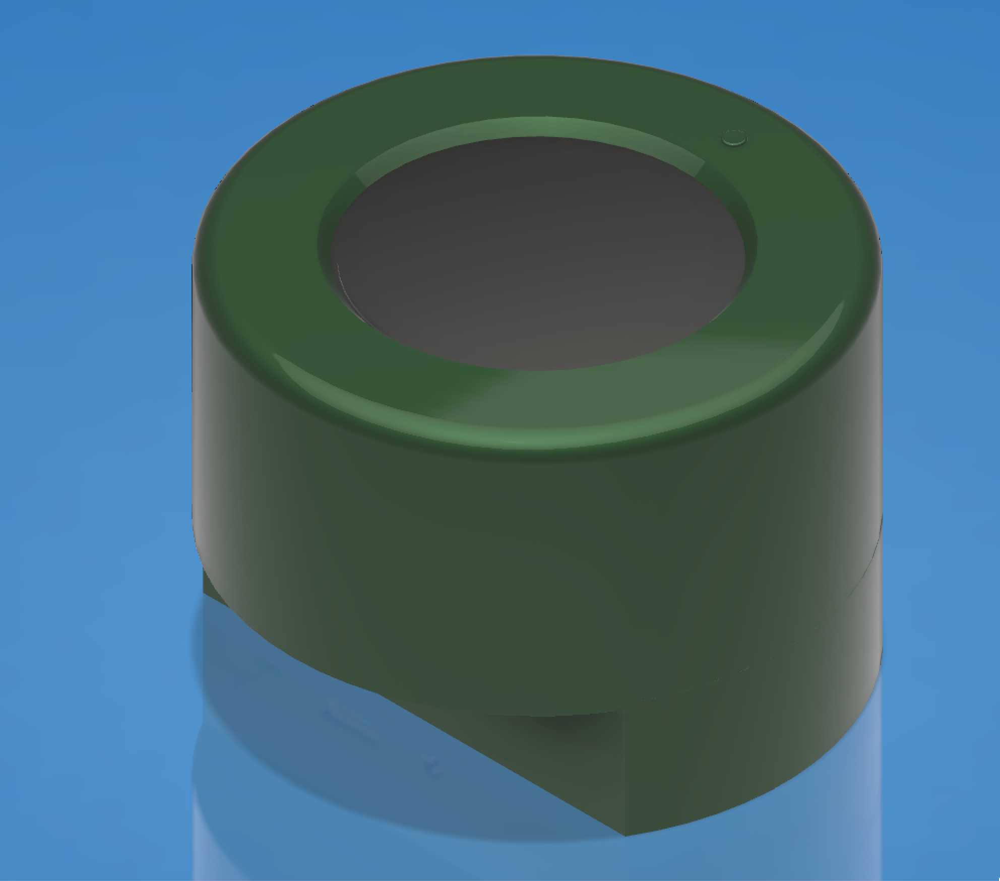
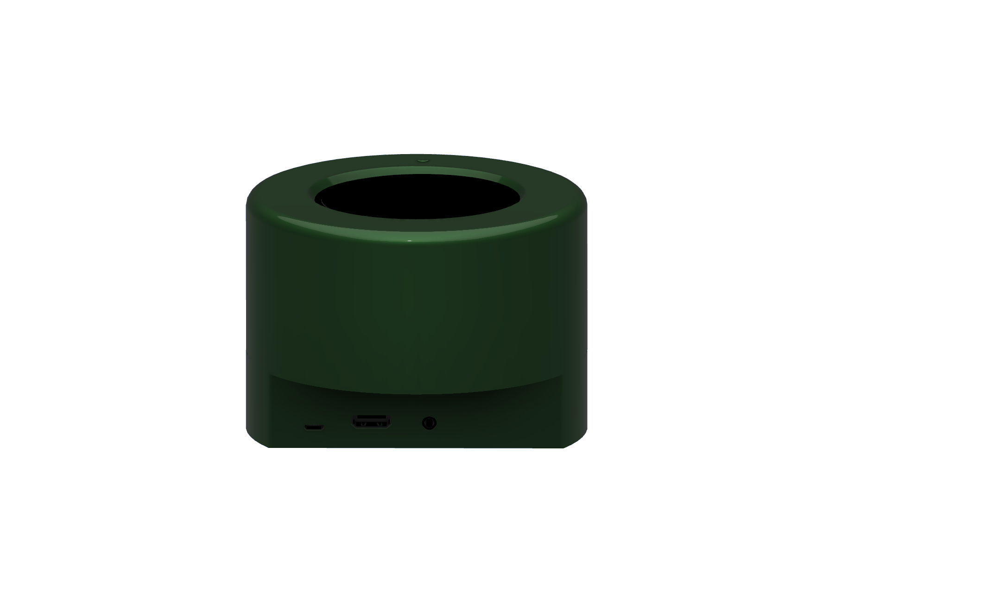
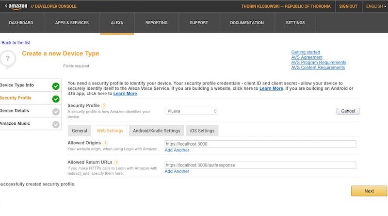
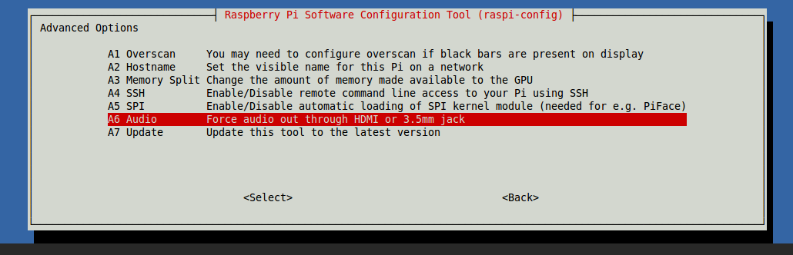

## DIGITAL ASSISTANT

B&R Devices Corporation, Leader in consumer electronics, is looking for a new kind of digital assistant product to launch in 2018.

The target of the product is able to interact with the user using the Amazon Alexa and provide several kind of data including weather, appointments, sport results, movie hours, etc.

The product should be affordable and easy to produce with digital fabrication technologies and processes.

The technology stack used will be based on the Raspberry PI 3, or Chip PRO linux board, that integrates or supports directional microphones and wireless connectivity.

Designers should craft an elegant shell around the electronics, taking into account tolerances and access to the Raspberry / Chip IO ports and power supply.

The final solution should have a retail value of 100 $ or less.

The project should include the product concept statement and its documentation in order to easily replicate the product in any lab.

### PRODUCT REQUIREMENTS

Able to interact with Amazon Alexa using voice commands
System activated with a custom Word. Alexa would be the default but customizable
Affordable. Its retail value should be 100 $ or less.
User friendly
Easy to produce in any lab

### MACHINES AND TOOLS

- 3D printer
- Laser cutter
- Precision CNC Mill, i.e. Roland SRM-20 
- Soldering iron

### BILL OF MATERIALS

- Chip PRO / Raspberry PI 3
- USB or integrated Microphone
- 4-8 ohm Speakers and Stereo amplifier
- LEDS
- 5V power supply
- Plywood
- ABS / PLA / rubber / cork / wood filament
- Silicone for molding and casting
- Machinable wax
- Resin for casting

### Building instructions

### Enclosure

<table>
  <tr>
    <td colspan="2">

    </td>
  </tr>
  <tr>
    <td>

</td>
<td>

  
</td>
</tr>
</table>

You can start from the design you can find in the shared [Fusion 360 Folder](http://a360.co/2eGPJqf).

3D Print the parts and assemble the assistant inserting the Raspberry and amplifier boards in the case.

### Parts list

The hardware assembly shouldn't take more than one hour work. The basic modules are the following:

- Controller, for example an Embedded Linux computer, such as [Raspberry PI 3](https://www.raspberrypi.org/products/raspberry-pi-3-model-b/)

  

- Audio amplifier and Speaker: you can start from an amplifier module such as [Adafruit 3W stereo amplifier](https://www.adafruit.com/product/987)

  

- Directional Microphone: can be embedded or USB, for example the following
  [Adafruit USB Microfone](https://www.adafruit.com/product/3367) uses very little space out of the Raspberry USB port 
  
  
- Button and LEDs attached to the controller GPIO Ports: 

A good idea could be to use an illuminated pushbutton for the press-to-talk functionality.

### Software

The software stack is based on the Alexa PI open-source project. This is a client for Amazon's Alexa service. It is intended and tested to run on a wide range of platforms, such as Raspberry Pi, Orange Pi, CHIP and ordinary Linux desktops.

>NOTE: if you want to setup multiple raspberry at one time, you can install one and clone the microSD card, using the [dd command](https://www.raspberrypi.org/forums/viewtopic.php?t=46911)

The following steps should be followed for the software:

- Install a clean [Raspbian Lite installation](https://downloads.raspberrypi.org/raspbian_lite_latest) in a microSD Card as the Raspberry PI operating system. In this case you won't have any GUI. But you can install the full Raspbian which does have XWindows.
- Configure the WiFi network: [this tutorial](https://learn.adafruit.com/adafruits-raspberry-pi-lesson-3-network-setup/setting-up-wifi-with-occidentalis) will guide through the setup
- Register an Amazon Account and Install AlexaPI, following the instructions at [this link](https://github.com/alexa-pi/AlexaPi/wiki/Installation) . Make sure you add your Raspberry IP address. 

- Enter the Amazon credentials you just created in the AlexaPI config file `/etc/opt/AlexaPi/config.yaml` 
- Connect speakers and microphone. If the speakers are HDMI setup this option using `raspi-config`

- Update the microphone address in the AlexaPi config `/etc/opt/AlexaPi/config.yaml` with the output of `alsarecord -L`.  [This page](https://github.com/alexa-pi/AlexaPi/wiki/Audio-setup-&-debugging) provides instructions for debugging audio)

### References

- Alexa PI Project: https://github.com/alexa-pi/AlexaPi