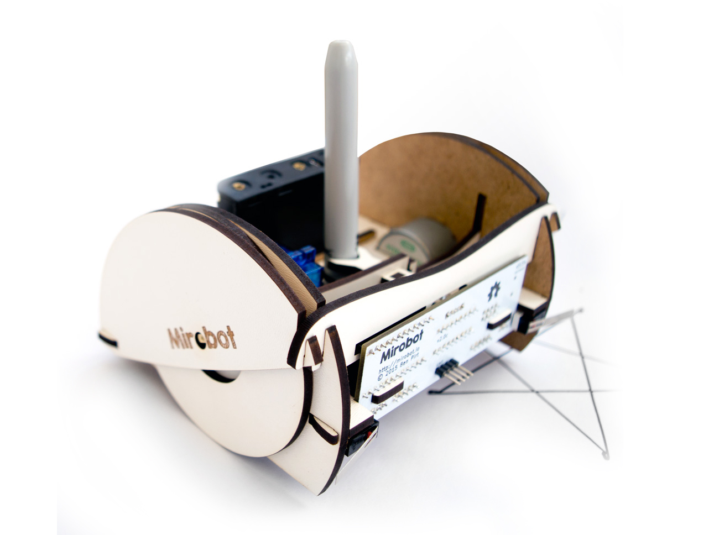
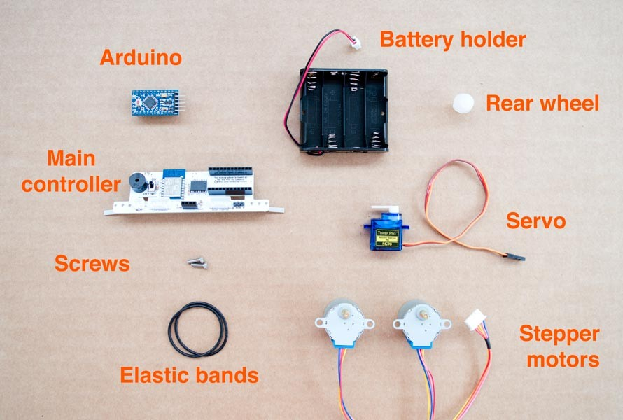
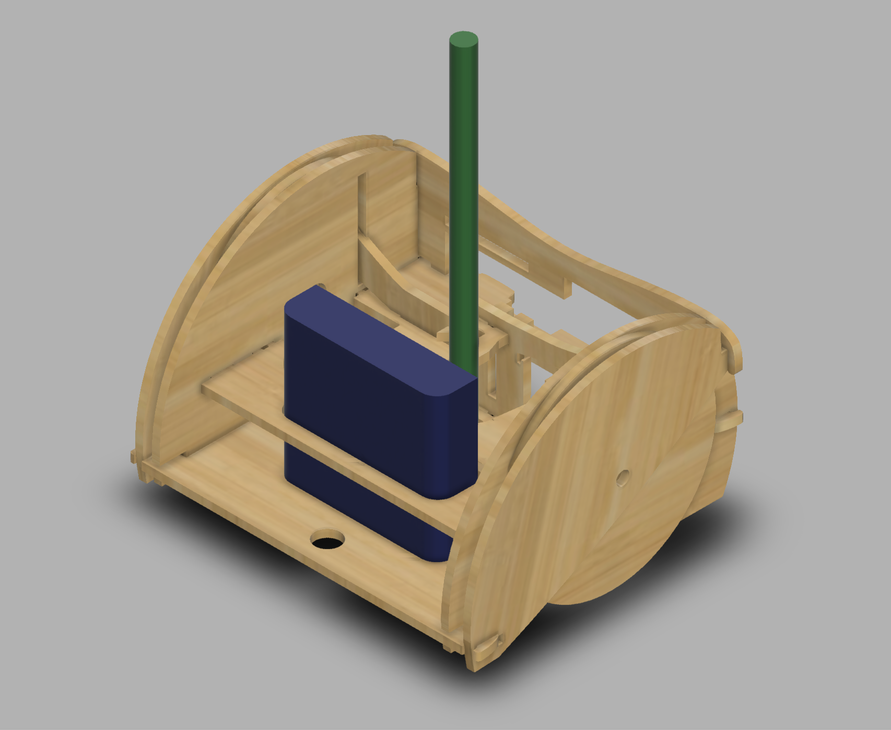
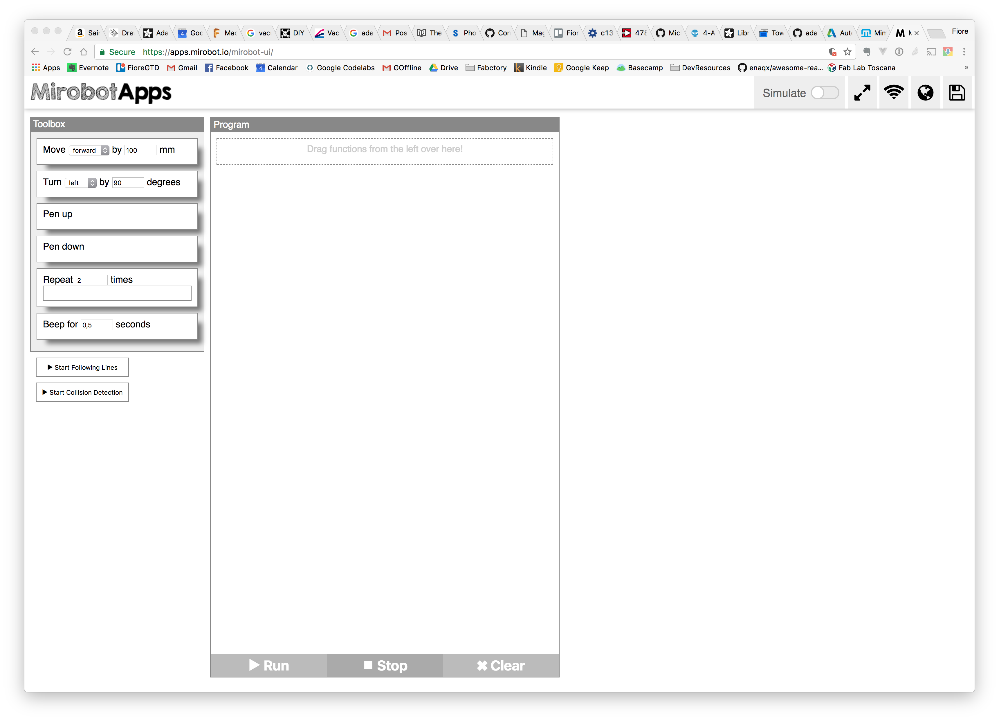
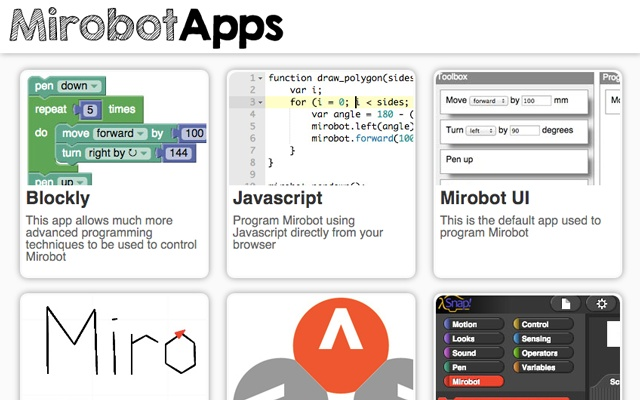
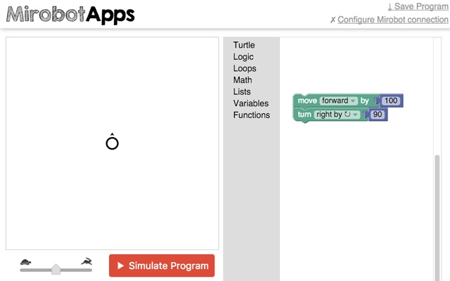

## DRAW BOT
 

 
DOT Corporation is looking for a new kind of robot which can draw and write.

The robot should be user friendly and suitable for kids.
It should be also affordable and as small as possible.

The design can be prototyped using laser cutting technology and it should include 3D printed parts. 

Designer should prototype their concept proposal in 4 hours maximum using the Open Source Drawbot structure provided.

The project should include the product concept statement and its documentation in order to easily replicate the product in any lab.
 

### PRODUCT REQUIREMENTS

- As small as possible
- User friendly
- Affordable
- Made using laser cutter and 3D printer


### MACHINES AND TOOLS

- 3D Printer
- Laser cutter
- Precision CNC Mill, i.e. Roland SRM-20 
- Soldering iron

### BILL OF MATERIALS

- Plywood
- Machinable wax
- Plexiglas
- ABS / PLA Filament
- Micro-controller
- Motors


### Building instructions

The project is based on the open-source [Mirobot](), that uses an Arduino Pro Mini and an ESP8266 for Wifi Control of the robot abilities. All components are integrated in a single board for convenient assembly.

The project includes two DC motors, and a Servo motor controlling the pen.



Once assembled you are ready to go.

### Custom design

You can customize the design starting from the [source files](https://github.com/fablabmade/mirobot-chassis) for the chassis, editable in illustrator or ready to cut.

The [PCB is also open source](https://github.com/fablabmade/mirobot-pcb
), and add-on boards are also provided for line following and programming ESP8266.

<table>
<tr>
<td width="50%">
<p></p>
</td>
<td>
<p></p>
</td>
</tr>
</table>

Finally you can start from the following [Fusion 360 Design](http://a360.co/2eykNs0) for redesigning the robot in 3D.

### Programming

Mirobot comes pre-programmed. In the Github repository you can find the ESP8266 and Arduino firmware.

It's easy to control the Mirobot using the provided Web interface, available after connecting to the WiFi network the Mirobot creates when switched on.

The interface is very similar to Scratch sketches, using visual blocks for robot actions.


  
It is also possible to program the Mirobot using the [Python Library](https://github.com/mirobot/mirobot-py)

```
  from mirobot import Mirobot

  # Connect to Mirobot
  mirobot = Mirobot()
  mirobot.autoConnect()

  # Put the pen down
  mirobot.pendown()

  # Move forward 100mm
  mirobot.forward(100)

  # Move back 100mm
  mirobot.back(100)

  # Turn left 45 degrees
  mirobot.left(45)

  # Turn right 45 degrees
  mirobot.right(45)

  # Lift the pen up
  mirobot.penup()

  # Beep for a second
  mirobot.beep(1000)

  # Print the state of the collision sensors
  print(mirobot.collideState())

  # Print the state of the line following sensors
  print(mirobot.followState())

  # Disconnect from Mirobot
  mirobot.disconnect()

```
<p style="page-break-after:always;"></p>

#### Google Chrome extension



Using this [Chrome extension](https://chrome.google.com/webstore/detail/mirobot/bjkfmkklaabeoomedlpgfplgndpiijea)

it's possible to load Mirabot apps directly from the browser into the robot:



### References

- [Mirobot](https://mime.co.uk/products/mirobot/)
- [Github archive]()