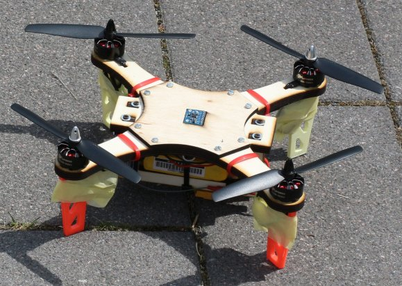
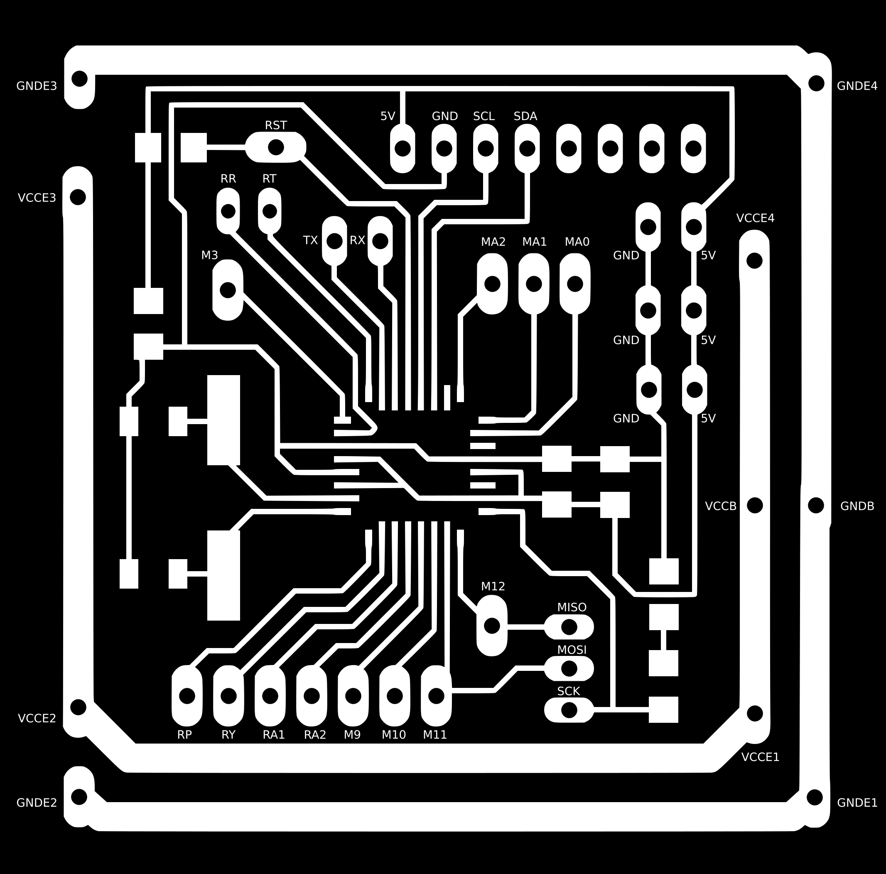
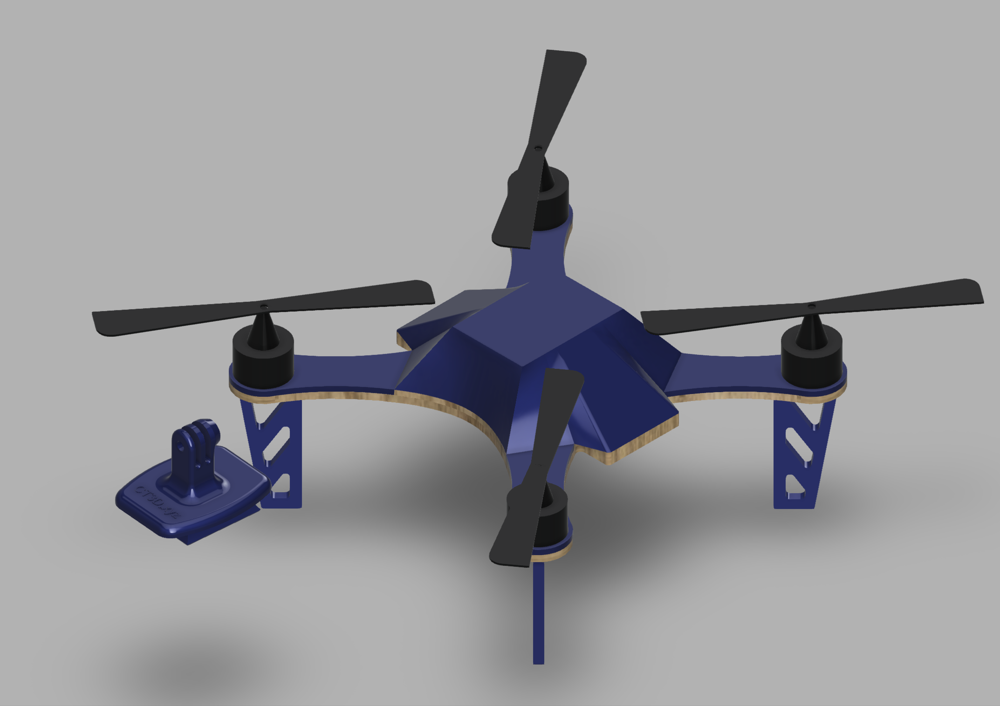

## DRONE QUAD COPTER 

The company needs to design a quadcopter for taking pictures at events and parties.

We selected the electronic and mechanic design, based on Daniele Ingrassia’s satshacopter project, that can be made using two or more digital fabrication technologies, processes and tools.

We recommend the laser cutter to make the frame and packaging, the 3D printer to make a shell for it and the vinyl cutter to complete the box.

The project should include the product concept statement and its documentation in order to easily replicate the product in any lab.

### PRODUCT REQUIREMENTS
	
- Lightweight as possible and less than 0.5 kg, able to carry a gopro camera
- Attractive and futuristic look
- Good picture quality
- Easy to control for a newbie
- Easy to produce in any lab in maximum 4 hours

### MACHINES AND TOOLS REQUIRED

- Laser cutter
- 3D printer
- Vinyl cutter
- Soldering iron 

### BILL OF MATERIALS

- Plywood and Cardboard
- Vinyl
- Open source flight controller 
- MPU6050 IMU located exactly at the center
- 4 x 1900kv brushless motors
- 4 x 15A ESCs
- MultiWii compatible
- Hobby King 4 channel remote and receiver
- 1000mah 3S LiPo battery

The detailed bill of material with purchase link can be found here:

https://github.com/satshacopter/satshacopter-250X/raw/master/docs/250X/250X_BOM.xlsx

### Building instructions

The Satshakit mainboard was designed to be made with standard fablab machines such as the Roland SRM20 and MDX20. 

Producing the board requires about 1 hour milling. Soldering the required components and testing the board should take about 1.5 hours.

Overall making a functional drone requires 3-4 days by a non expert. We recommend to make the drone beforehand so that participants can focus on the enclosure design, marketing and business planning.

The following main tasks are required to assemble the drone:

- Laser-cutting the drone frame. [Frame DXF](https://github.com/fablabmade/satshacopter-250X/raw/master/design_files/main_frame_and_supports_8mm.dxf)

- Building and stuffing the Flight Controller Board, see [Eagle files](https://github.com/fablabmade/satshacopter-250X/tree/master/eagle_projects/satshakit_flight_controller) and [Electronic components BOM](https://github.com/fablabmade/satshacopter-250X/raw/master/docs/250X/250X_BOM.xlsx)

- Printing the feet and support using the [3D Printed models](https://github.com/fablabmade/satshacopter-250X/raw/master/design_files/foot.stl) 

- Assembling the frame and placing ESCs, motors, receiver and Flight Controller board.

- Wiring: ESC should be connected now to motors and flight controller. Same applies for the battery and radio receiver. Follow the manual below for wiring instructions.

The project is quite complex, for the assembly instructions refer to the project's building manual:

[Build Manual PDF](https://github.com/satshacopter/satshacopter-250X/raw/master/docs/250X/satshacopter-250x-building-manual.pdf)

### Enclosure

You can start your design from the provided model in the [Fusion 360 Folder](http://a360.co/2gMKf1j). 

The design includes also a Go-PRO Camera holder, that you can adapt to your camera model.

### References

The project is based on Daniele Ingrassia's [Satshacopter-250](
https://github.com/satshacopter/satshacopter-250X)

