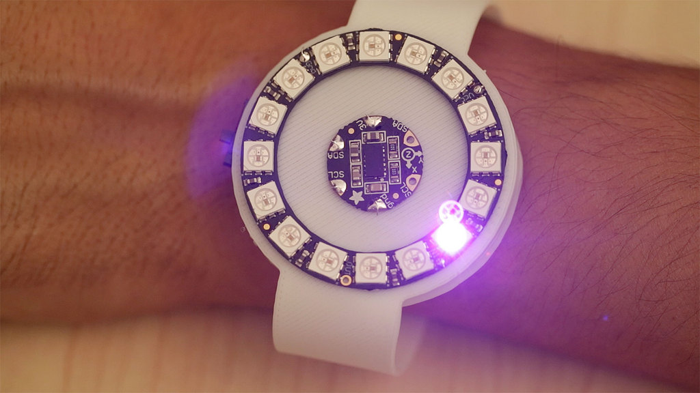
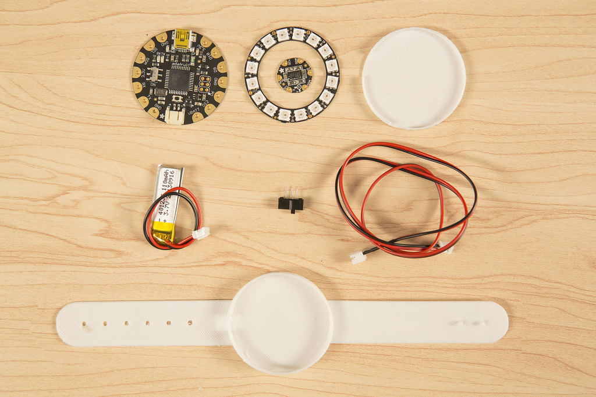
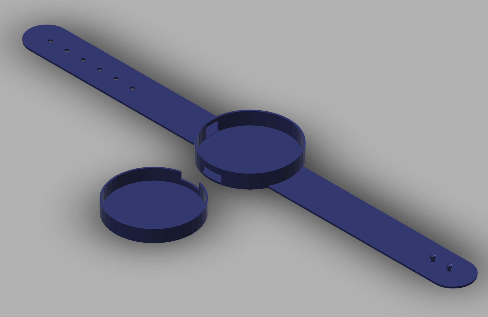
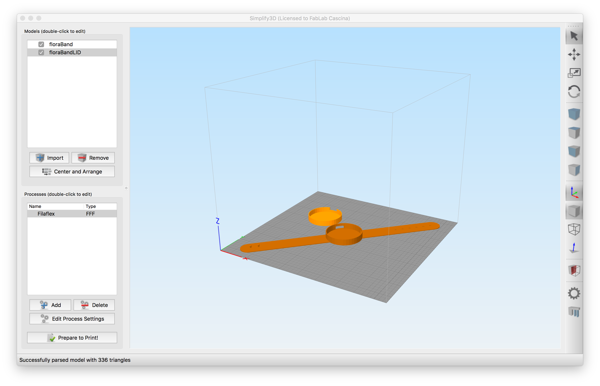
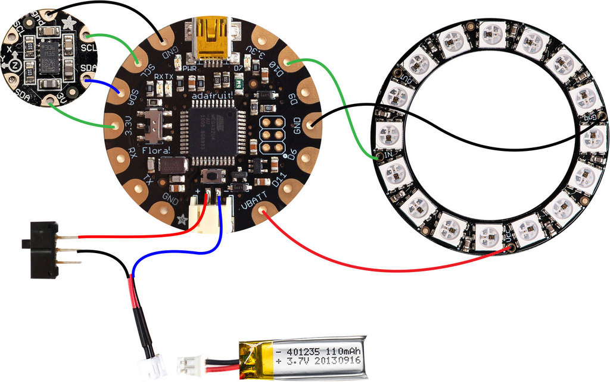
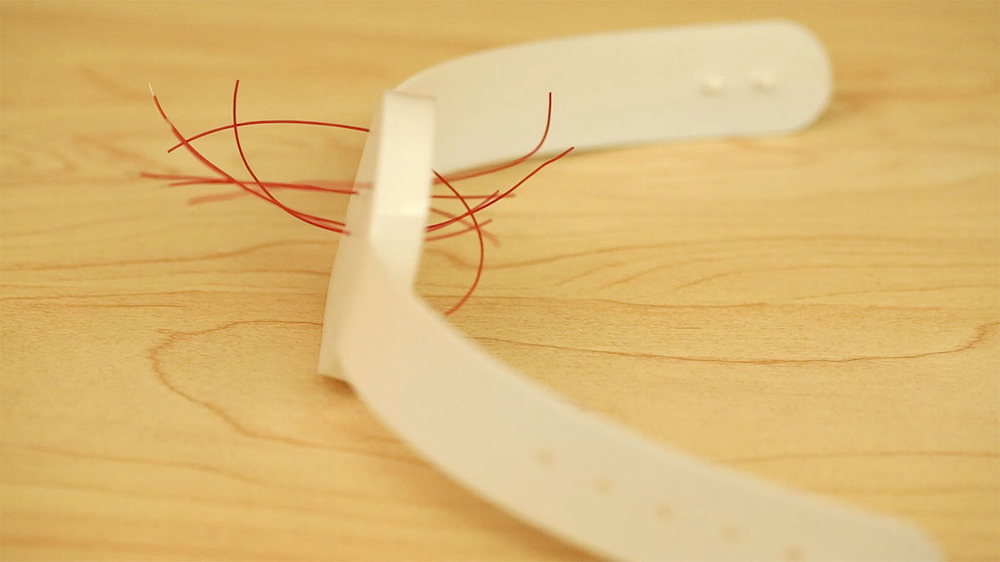
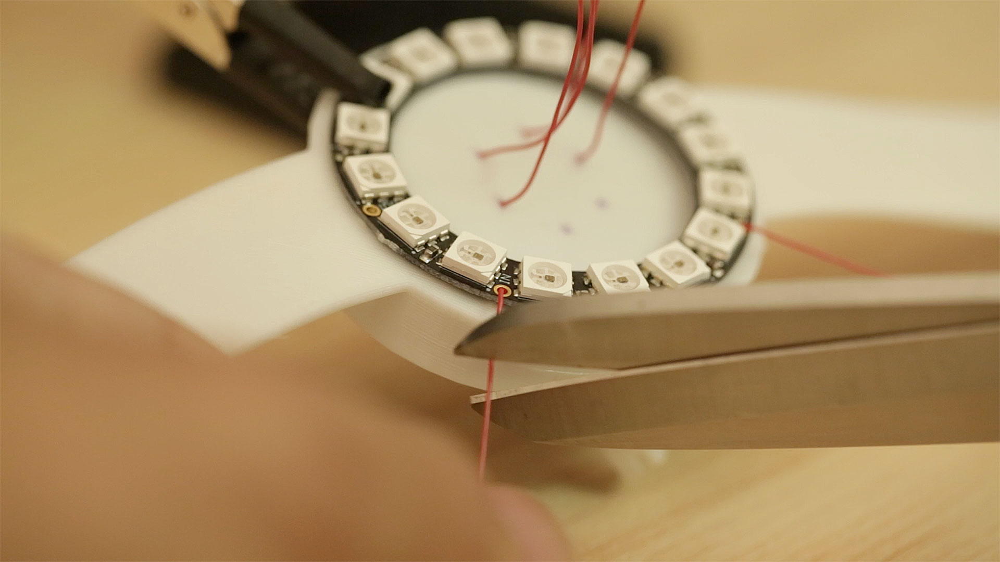

## FITNESS TRACKER 



Design, develop and prototype a user-friendly non invasive wearable fitness tracker, suitable for runners and people who regularly workout, but also for normal people who want to track their activity.

The product should be as small and lightweight as possible and easy to wear. The power consumption should be low, to allow at least 12 hours operation.

It should also be waterproof and comfortable to wear, made with soft materials like leather, silicone, rubber and plastics.

We recommend to prototype the product using or combining 3D printing flexible filament and laser cutting technologies or molding and casting processes.

The device should also embed a mini display, and optionally be able to collect and send data via bluetooth.

The project should include the product concept statement and its documentation in order to easily replicate the product in any lab.

### PRODUCT REQUIREMENTS

- Lightweight and small as possible 
- User-friendly 
- Low power
- Comfortable
- Waterproof
- Made of soft materials (leather, silicone, rubber, plastics).
- Easy to produce in any lab in maximum 4 hours


### MACHINES AND TOOLS

- 3D Printer
- Laser cutter
- Precision CNC Mill, i.e. Roland SRM-20 
- Soldering iron


### BILL OF MATERIALS

- Microcontroller (tiny form factor), Flora optionally w/Bluetooth LE module
- Flora Accelerometer LM303
- LIPO battery
- Flexible filament
- Leather / Fabric
- Silicon and soft rubber for casting
- Machinable wax

### Build instructions

The project is composed by a mainboard (Adafruit Flora),an accelerometer (Adafruit LM303), and an RGB LED ring (12 Neopixels), a lipo battery and a flexible enclosure.



The assembly process should follow this order:

  - 3D Printing the enclosure

  - Testing and wiring the circuit boards

  - Uploading the sketch

  - Perforating the enclosure to run wires

  - Integrating the parts together


### Enclosure



You can use the design in the shared [Fusion 360 Folder](http://a360.co/2xaKTwJ) as a starting point for your customization.


### 3D Printing



You can produce a full enclosure using the NinjaFlex filament using a standard 3D Printer.

The following files can serve as a starting point for the project:

https://www.thingiverse.com/thing:221609

>TIP: If you have stringing problems in your print, print the two parts separately.

>NOTE: The best temperature for printing NinjaFlex on the ultimaker is 225 degrees. Also you should set 105% flow for best surface finishing.

### Wiring



The wiring should connect the three boards together, the accelerometer needs GND, 3V, SCL, SDA to talk to the Flora ATMega328p using the I2C (TwoWire) protocol.

The Neopixel ring can be addressed via the D10 Flora Pin, using the Neopixel's onewire protocol. You need to connect the D10 to the In pin on the Neopixel Ring, then VBAT to VCC, and GND to GND on the ring.

Power will be given by a Lipo 3.7v battery connected to the Flora. 

You need to pass wires on the bottom of the watch case, which in fact will be the top of your watch, with the cap on the bottom.

<table>
  <tr>
    <td width="50%">
      <p></p>
    </td>
    <td>
      <p></p>

    </td>
  </tr>
</table>

### Programming

The programming of the project can be done using the Arduino IDE.

**Preparation**

You need to add support to the various boards through the Arduino Board manager and add the required libraries using the Library Manager.

  1. Add Adafruit Flora to the boards supported by Arduino: Open Arduino and select the menu File > Preferences 
  2. Set the following URL in the "Additional Boards Manager URL" field:
     https://adafruit.github.io/arduino-board-index/package_adafruit_index.json
  3. Open the Board manager using the Tools->Board->Board Manager menu
  4. Search for Adafruit AVR Boards and click Install on the bottom right
  5. Now add the libraries: Sketch menu, > Include Library > Manage Libraries... and add the following Libraries: 
     - Adafruit NeoPixel by Adafruit
     - Adafruit GFX Library
     - Wire
     - Adafruit_LSM303

**Working with the accelerometer**

The accelerometer is a digital sensor, so it must be initialized before using. The data read from the accelerometer include a vector (x,y,z) with the relative acceleration at a given time.

In order to process this information we can use different approaches of increasing complexity, including [Hidden Markov Models](http://www.dcs.gla.ac.uk/~jhw/gesturehmm.html), [DWT](https://en.wikipedia.org/wiki/Dynamic_time_warping) and other kins of classifiers.

These methodologies require a **training** session to be done beforehand, and use the acquired sample data for comparing if a sensor's reading can be considered a gesture or not.

For the sake of simplicity and also according to the not so powerful ATMega328p specs, we will just measure the differences between discrete readings of the sensor and set a threshold from which we start recognizing if there was a movement or not.


**Code**

The following code measures the overall amplitude of a movement in all axes and flashes the LEDs accordingly. 

The exercise is to modify the code to count the steps using the same technique, then light the LEDs in sequence for groups of 10 steps.
```
  #include <Wire.h>
  #include <Adafruit_LSM303.h>
  #include <Adafruit_NeoPixel.h>
 
  // Parameter 1 = number of pixels in strip
  // Parameter 2 = pin number (most are valid)
  // Parameter 3 = pixel type flags, add together as needed:
  //   NEO_RGB     Pixels are wired for RGB bitstream
  //   NEO_GRB     Pixels are wired for GRB bitstream
  //   NEO_KHZ400  400 KHz bitstream (e.g. FLORA pixels)
  //   NEO_KHZ800  800 KHz bitstream (e.g. High Density LED strip)
  Adafruit_NeoPixel strip = Adafruit_NeoPixel(16, 10, NEO_GRB + NEO_KHZ800);
  Adafruit_LSM303 lsm;
 
  // Here is where you can put in your favorite colors that will appear!
  // just add new {nnn, nnn, nnn}, lines. They will be picked out randomly
  //                                  R   G   B
  uint8_t myFavoriteColors[][3] = {{200,   0, 200},   // purple
                                   {0,   117,   255},   // blue 
                                   {200, 200, 200},   // white
                                 };
  // don't edit the line below
  #define FAVCOLORS sizeof(myFavoriteColors) / 3
 
  // mess with this number to adjust TWINklitude :)
  // lower number = more sensitive
  #define MOVE_THRESHOLD 300
 
  void setup() 
  {
    Serial.begin(9600);
  
    // Try to initialise and warn if we couldn't detect the chip
    if (!lsm.begin())
    {
      Serial.println("Oops ... unable to initialize the LSM303. Check your wiring!");
      while (1);
    }
    strip.begin();
    strip.show(); // Initialize all pixels to 'off'
  }
 
  void loop() 
  {
    // Take a reading of accellerometer data
    lsm.read();
    Serial.print("Accel X: "); Serial.print(lsm.accelData.x); Serial.print(" ");
    Serial.print("Y: "); Serial.print(lsm.accelData.y);       Serial.print(" ");
    Serial.print("Z: "); Serial.print(lsm.accelData.z);     Serial.print(" ");
 
    // Get the magnitude (length) of the 3 axis vector
    // http://en.wikipedia.org/wiki/Euclidean_vector#Length
    double storedVector = lsm.accelData.x*lsm.accelData.x;
    storedVector += lsm.accelData.y*lsm.accelData.y;
    storedVector += lsm.accelData.z*lsm.accelData.z;
    storedVector = sqrt(storedVector);
    Serial.print("Len: "); Serial.println(storedVector);
  
    // wait a bit
    delay(100);
  
    // get new data!
    lsm.read();
    double newVector = lsm.accelData.x*lsm.accelData.x;
    newVector += lsm.accelData.y*lsm.accelData.y;
    newVector += lsm.accelData.z*lsm.accelData.z;
    newVector = sqrt(newVector);
    Serial.print("New Len: "); Serial.println(newVector);
  
    // are we moving 
    if (abs(newVector - storedVector) > MOVE_THRESHOLD) {
      Serial.println("Twinkle!");
      flashRandom(5, 1);  // first number is 'wait' delay, shorter num == shorter twinkle
      flashRandom(5, 3);  // second number is how many neopixels to simultaneously light up
      flashRandom(5, 2);
    }
  }
 
  void flashRandom(int wait, uint8_t howmany) {
 
    for(uint16_t i=0; i<howmany; i++) {
      // pick a random favorite color!
      int c = random(FAVCOLORS);
      int red = myFavoriteColors[c][0];
      int green = myFavoriteColors[c][1];
      int blue = myFavoriteColors[c][2]; 
 
      // get a random pixel from the list
      int j = random(strip.numPixels());
      //Serial.print("Lighting up "); Serial.println(j); 
    
      // now we will 'fade' it in 5 steps
      for (int x=0; x < 5; x++) {
        int r = red * (x+1); r /= 5;
        int g = green * (x+1); g /= 5;
        int b = blue * (x+1); b /= 5;
      
        strip.setPixelColor(j, strip.Color(r, g, b));
        strip.show();
        delay(wait);
      }
      // & fade out in 5 steps
      for (int x=5; x >= 0; x--) {
        int r = red * x; r /= 5;
        int g = green * x; g /= 5;
        int b = blue * x; b /= 5;
      
        strip.setPixelColor(j, strip.Color(r, g, b));
        strip.show();
        delay(wait);
      }
    }
    // LEDs will be off when done (they are faded to 0)
  }
```

### References

This project is based on [Adafruit Flora tutorial](https://learn.adafruit.com/3d-printed-flora-band)