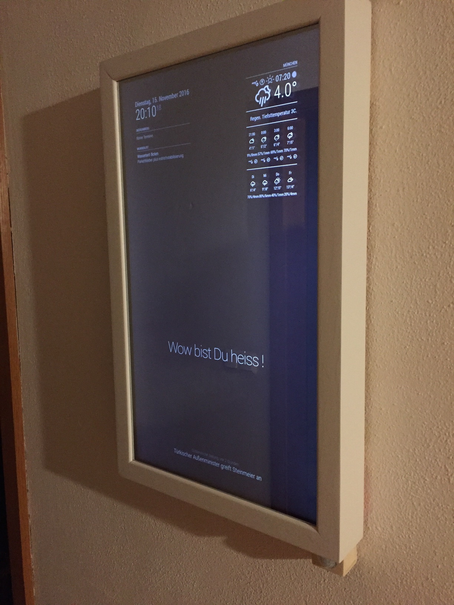
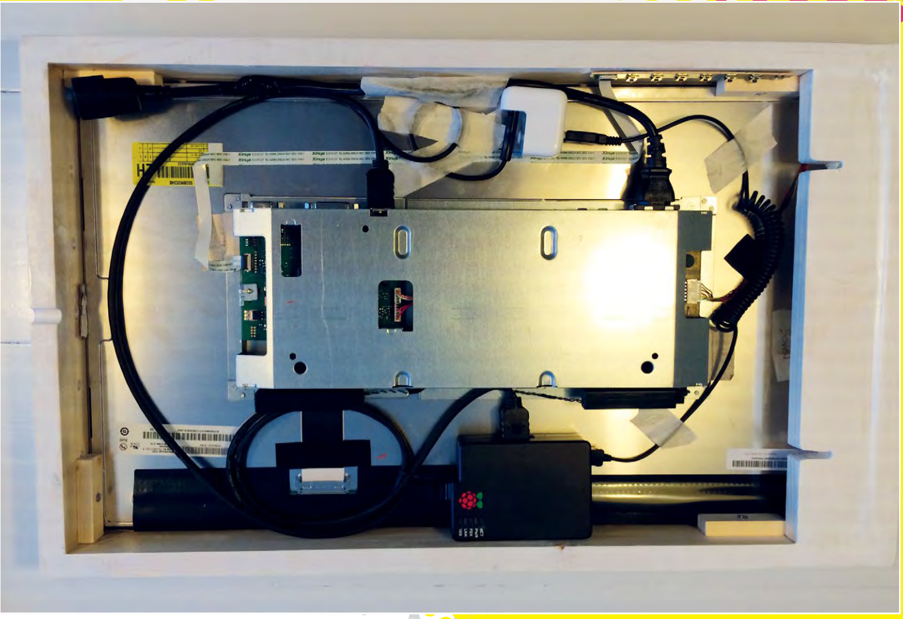

## MAGIC MIRROR



Mirrora company wants to launch a new interactive mirror that adds dynamic information to the classic room mirror.

The underlying hardware will include a Raspberry 3 computer and a barebones LCD monitor of 10’’. The software will allow to visualize information such as time and date, weather reports, news feed and calendar, based on the MagicMirror 2 open source project.

Designers should prototype a frame and fancy shell for the product to embed the electronics using the laser cutter.

The project should include the product concept statement and its documentation in order to easily replicate the product in any lab.

### PRODUCT REQUIREMENTS

User friendly
Attractive
Easy to produce in any lab in 4 hours maximum

### MACHINES AND TOOLS

3D Printer
Laser cutter
Soldering iron

### BILL OF MATERIALS

- LCD Monitor 10-15’’
- Raspberry PI 3
- Mirror silver vinyl
- Plywood / Plexiglass

### Building instructions

The main modules are:

- Raspberry PI 3
- Monitor or TV of suitable size with HDMI Output
- Picture frame of suitable size, thick enough to hide the Monitor
- See-thru film or spy mirror (such as those used in cars)




You need to fix the TV or Monitor inside the Picture frame, in a way that the monitor is not visible any more. You should leave enough space to also fit the Raspberry PI 3 and make a hole for the power cable for screen and Raspberry (you can also use a powerbank to power the raspberry, but not the TV).

Once you have everything working, apply the spy film on the mirror and test the visibility, you might need to change the luminosity and contrast of your monitor for best results. In alternative it is possible to get an acrylic two-way mirror. In either case you need to measure the size of the existing picture frame for exact dimensions.

### Power cable

Tip: for best results you can open an USB Charger and run the monitor power wire through it in order to have a powered 5V USB port ready for the Raspberry and a single cable hanging out of the mirror.

For a really clean job you can put a power port on one side of the mirror:

You need to look for ["c13 IEC cord 10 amps"](https://en.wikipedia.org/wiki/IEC_60320#C13.2FC14_coupler)

This is one type: 


https://www.digikey.it/product-detail/it/qualtek/710W-00-03/Q223-ND/245564


### Software

The Magic Mirror is based on the [MagicMirror2 open source project](https://github.com/MichMich/MagicMirror) which provides a number of ready-made widgets as well as an API to build your own.


### Loading the software

For the software side you need to prepare an SD Card for the Raspberry PI.

This should be a basic Raspbian image.

Configure the Raspberry PI 3 Wireless network and connect to a shell, [described in the Digital Assistant guide](digital-assistant.md), you will now edit the boot config to rotate the screen:

```$ sudo nano /boot/config.txt```

Look for the following labels or add them if they are not there:

```
display_rotate=1
avoid_warnings=1 
```

Diable the power saving for the wireless card (causes lock-ups)

```sudo nano /etc/network/interfaces```

And add the following line after the wlan0 section ()

```sudo wireless-power off```

Reboot the raspberry 

```sudo shutdown -r now`

Finally type in the following to install Magic Mirror:

```
curl -sL http://magpi.cc/MirrorInstall | bash
```

Configure the options:

```
cp ~/MagicMirror/config/config.js.sample ~/MagicMirror/config/config.js
nano ~/MagicMirror/config/config.js
```

You can set the following:

- port: the port where you can connect to the smart mirror ex. http://<your raspberry ip>:port
- zoom: the zoom factor for the interface
- language
- timeFormat: 12 or 24 hours
- units: metric or imperial

In the article linked in the reference you find other options for customizing the interface.

### Modules

The following modules are installed by default.

* Clock
* Calendar
* Current Weather
* Weather Forecast
* News Feed
* Compliments
* Hello World
* Alert

You can add 3rd party or custom modules using the shell (or SSH) cloning them from git into the ```~/MagicMirror/modules``` folder.

Contributed modules are available at the following URL:

https://github.com/MichMich/MagicMirror/wiki/MagicMirror%C2%B2-Modules

### References

- [MagicMirror2 open source project](https://github.com/MichMich/MagicMirror)
- [MagPI issue 54: Make your own Magic Mirror pp.14](https://www.raspberrypi.org/magpi-issues/MagPi54.pdf)