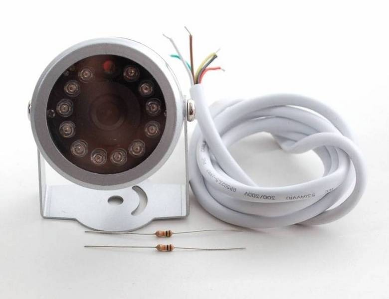
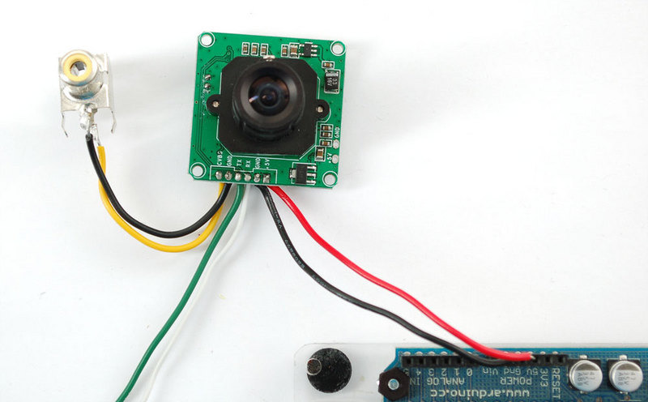
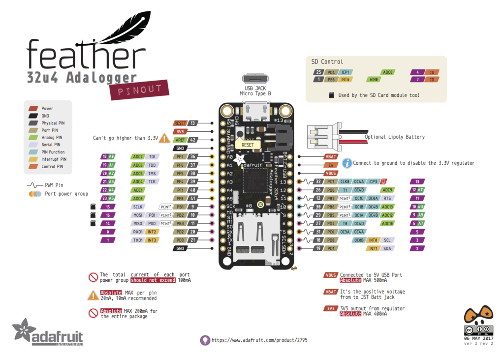
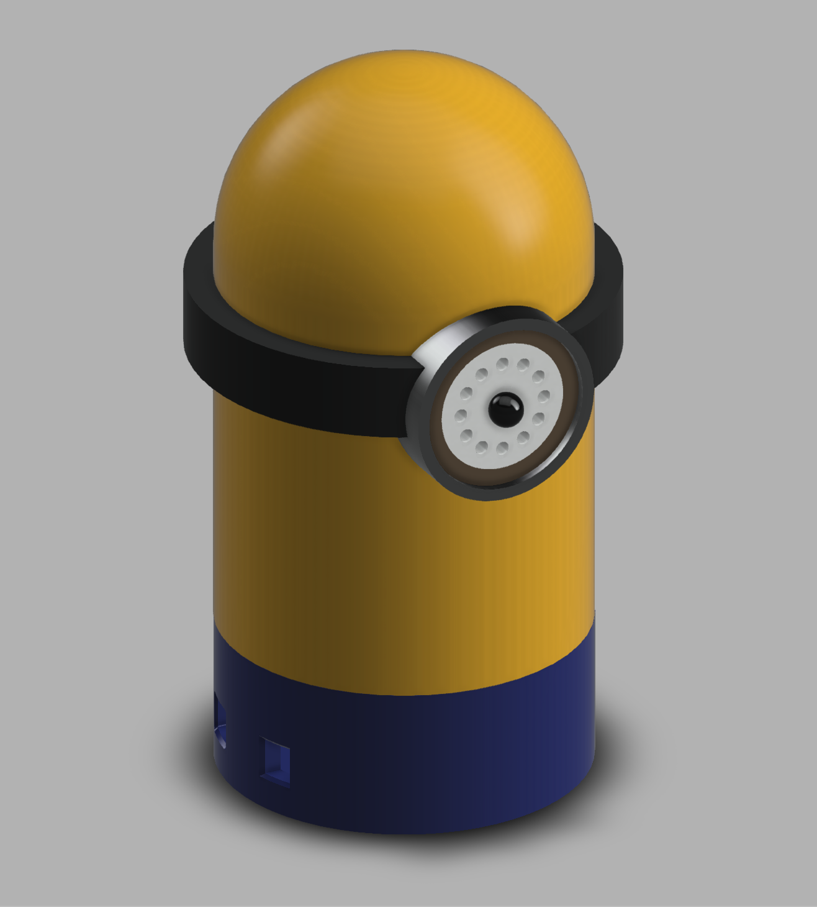

## SECURITY CAM


H.I.D.E.. Company is looking for produce a new affordable kind of security camera suitable to control babies in the house. The camera should work in the darkness and notify when some movement happens.

The task of Designer is to develop and prototype a shell to embed the cam and the electronics using digital fabrication technologies and processes.

The product should be as small as possible and completely made of plastics.
We recommend to use 3D printing technology or molding and casting processes to prototype the product.

### PRODUCT REQUIREMENTS

- Affordable. Its retail value should be 80 $ or less
- Easy to produce in any lab in 4 hours maximum
- Made of plastics

### MACHINES AND TOOLS

- 3D Printer
- Laser cutter
- Precision CNC Mill, i.e. Roland SRM-20 
- Soldering iron

### BILL OF MATERIALS

- [Adafruit Feather Adalogger](https://www.adafruit.com/product/2795)
- Security JPEG Camera
- MicroSD Card
- ABS / PLA Filament

### Building instructions

#### Wiring the camera



- Red is connected to +5V in
- Black is connected to Ground
- Green is RX
- White is TX
- Yellow is NTSC Video signal out
- Brown is NTSC Video ground

You can connect the RX to the TX pin of Arduino, and vice-versa. But you will loose the ability to control the Arduino with the Serial Console. In alternative you can use the [SoftwareSerial Library](https://www.arduino.cc/en/Reference/SoftwareSerial) to use arbitrary pins.

**Testing the camera**

You can solder an RCA female pin to the Yellow-Brown cables and attach the camera to an old TV



Another test is connecting the RX, TX, 5V and GND wires to an FTDI Cable. Then use the following Windows software to connect and configure the camera:

[VC0706 Comm Tool - Windows control software](http://www.adafruit.com/datasheets/VC0706CommTool(EN)%20Setup%20V1-00.exe)

> Tip: If the connection doesn't work You might have to swap the green and white wires

For Linux is possible to take a picture with the camera using the following python [script](https://raw.githubusercontent.com/adafruit/Adafruit-VC0706-Serial-Camera-Library/master/getimage0706.py), works great on a Raspberry PI for example.


### Wiring the SD Card adapter

If you are not using the Adafruit Feather Adalogger board, but a normal Arduino you might need to wire the SD Card Adapter and test it with the provided example from the producer.

The Sketch below is compatibly with all SD Adapters supported by the Arduino SD library.

> The SD Card is necessary to save the images taken by the camera. Transferring them to the serial port takes more than 30 seconds.


### Pinout

You can refer to the following PinOut for the final wiring:




In particular the following Pins are used for the SD Card and should not be connected to the camera:

- 25
- 1
- 4 CS
- 7 CD

### Programming

In order to be able to control the Camera from Arduino you will need to install the following library:

- [VC0706 Library](https://github.com/adafruit/Adafruit-VC0706-Serial-Camera-Library)

Once the library is installed you should open the File > Examples > Adafruit VC0706 Serial Camera Library > MotionDetect and flash it to the board.

Now find the line:

```
  #define chipSelect 10
```

And change this to the CS pin, in our case is 4. Finally update the serial connection pins, to the ones you choose during the wiring:

```
SoftwareSerial cameraconnection = SoftwareSerial(2, 3);
```
  
The library has a useful function for detecting motion ```cam.motionDetected()```.  Each time it detects the motion a new JPG image is saved on the SD Card. Check out the example for the full documentation.

### Enclosure



Given the project requirements we designed a Minion Enclosure, you can find the source in the [Fusion 360 Archive](http://a360.co/2vG3kJy).

You should 3D Print it using different colors for the parts, then glueing back everything together for safety.
