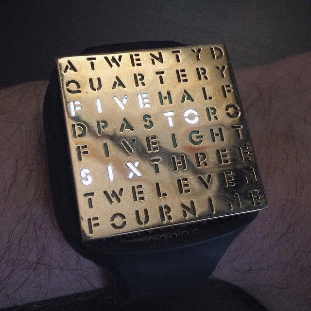
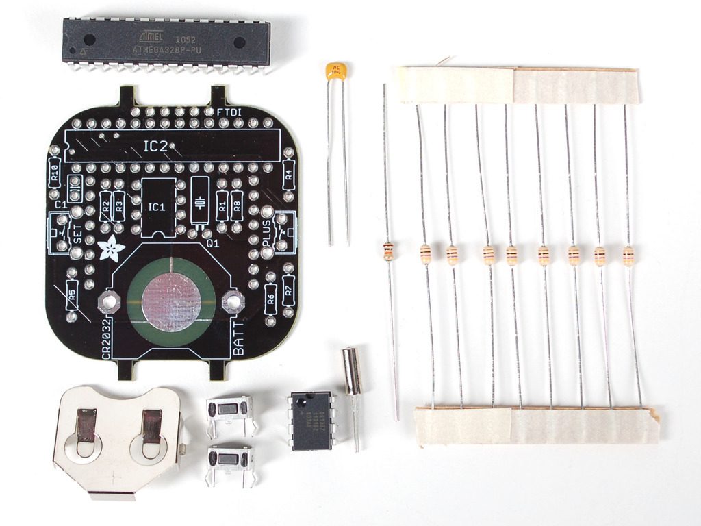
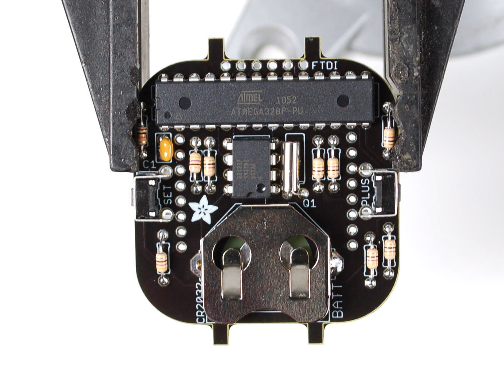
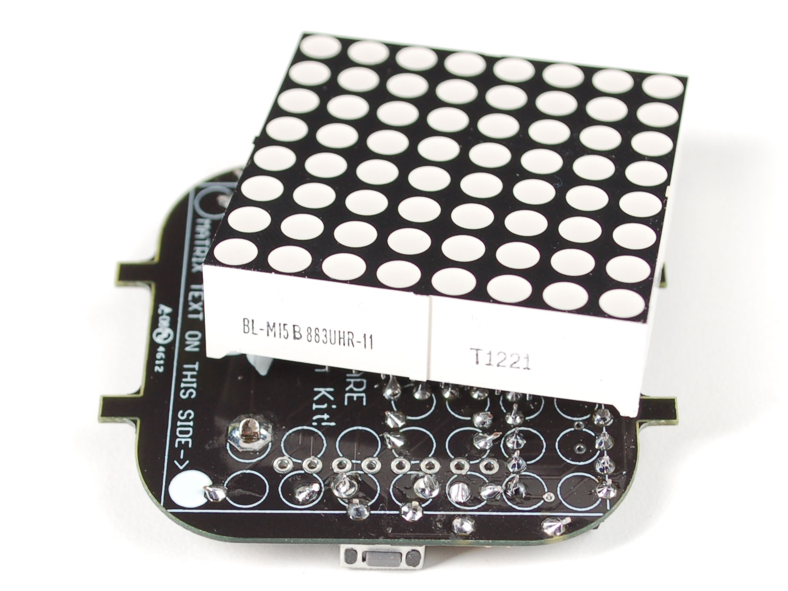

## SMART WATCH

CLOK Company is looking for a new affordable kind of smartwatch to develop in 2018.The product should be suitable for kids and comfortable to wear. It should look fancy and attractive, but extremely easy to use. 

Designer should develop and prototype their concept proposal including the design of the clock and its band, starting from the Adafruit Watch kit provided but fully customizing shape and size. Particular attention should be paid to the aesthetics and ergonomics and the materials of the proposed design concept.

Designer should develop and prototype their proposal using digital fabrication technologies and processes. We recommend to prototype the product using or combining 3D printing, laser cutting and molding and casting processes.

The project should include the product concept statement and its documentation in order to easily replicate the product in any lab.

### PRODUCT REQUIREMENTS
	
- Easily replicable in any lab in maximum 4 hours
- Suitable for kids, male and female
- Very easy to use
- Fancy and attractive look
- Affordable
- Comfortable 

### MACHINES AND TOOLS
	
- 3D Printer
- Laser cutter
- Precision CNC Mill, i.e. Roland SRM-20 
- Soldering iron

### BILL OF MATERIALS

- 8x8 ultra-bright red matrix display
- ATmega328P chip with Arduino Bootloader
- DS1337 real time clock
- CR2032 coin cell included
- Silicone for molding and casting
- Leather

### Building instructions

For building the project we create a variant that uses LEDs that contains letter. This way the time is spelled in words.

For building the watch we need to:

- Solder the TimeWatch kit components (see the [tutorial](https://learn.adafruit.com/timesquare-watch-kit/kit-assembly))

The LED matrix should be soldered on the bottom of the board, with the Text in the same direction as the arrow:

- Laser-cut the Word frame on veneer wood or other opaque material. Use the provided [DXF File](https://github.com/fablabmade/Wordclock-Wristwatch/raw/master/faceplates%20%26%20housing/wordclock_faceplate_ponoko.dxf) as a starting point

- Program the board

- Assemble the kit

### Programming

**Preparation**

The watch must be programmed using an FTDI Cable / Adapter such those used for Fab Academy Hello Echo board.

Solder the FTDI Headers in the TimeWatch board and connect a cable like this:

You also need to install the required libraries, and if you didn't before the driver for the [FTDI Cable](http://www.ftdichip.com/FTDrivers.htm):

- [Adafruit GFX Library](https://github.com/adafruit/Adafruit-GFX-Library)
- [RTClib](https://github.com/adafruit/RTClib)

** Upload the Word Watch Sketch**

You can find the source at the following url:

https://github.com/fablabmade/Wordclock-Wristwatch

>Download the Zip file and rename it as Watch in the Documents>Arduino>Libraries folder.

Open the Arduino IDE and select Examples > Watch > WordclockWatch and program the board selecting the Board as a **LilyPad Arduino with ATmega328**.

>**Exercise** Change the Sketch to show the time in another alphabet.