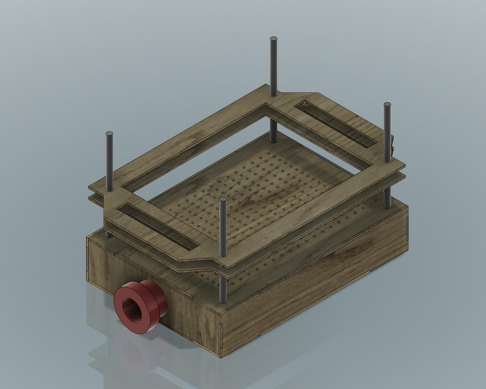
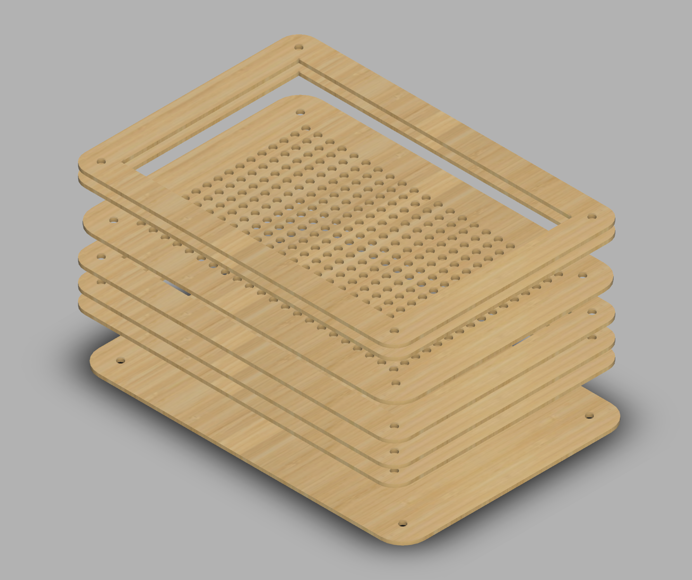
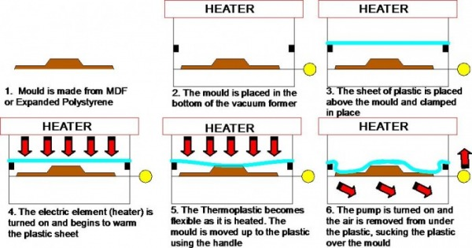
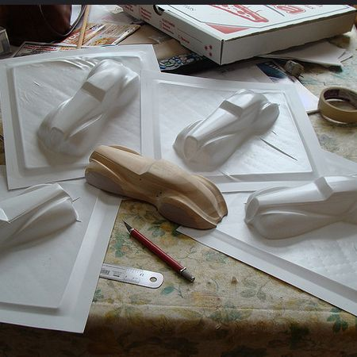

## VACUUM FORMER

Vacuum Company is looking for a vacuum former machine which allows people to easily pack their stuff. 

The product should be affordable and portable.

The design should be prototyped using laser cutting technology and include 3D printed parts. We recommend to use plywood or plexiglass and plastics to make the product as affordable as possible.

Designer should prototype their concept proposal in 4 hours maximum using the start files provided.

The project should include the product concept statement and its documentation in order to easily replicate the product in any lab.

## PRODUCT REQUIREMENTS
	
- Easily replicable in any lab in maximum 4 hours
- Easy to use
- Made of plywood and plastics
- Parametric model
- Affordable

## MACHINES AND TOOLS
	
- Laser cutter
- 3D printer
- Vinyl cutter
- 1000w Vacuum cleaner

## BILL OF MATERIALS

- Plywood 
- Plexiglass
- ABS / PLA Filament
- Vinyl

### Building instructions

You can build the Vacuum Former from the following [Fusion 360 Model](http://a360.co/2iWRcxN)

In the folder you can find a Parametric design that can be customized to make an arbitrary size. The wider the bed, the more powerful the vacuum should be.

For Laser Cutting you can export the shapes for all bodies and create a layout on a piece of wood or acrylic.

3D Print the hose connector adapting it to the size of your vacuum cleaner.

### Operating instructions

- Place a small object on the bed. Make sure it doesn't melt when heated for short periods of time to more than 100c

- Place a sheet of PETG between the frame, cut it at size in a way that doesn't cover the screw holes

- Position the frame using the reference screws as shown in the figure at the top of the page

- Heat up the PETG sheet using an heat-gun for PCBs. Wait till the PETG sheet bends significantly. 

- Move the frame towards the bed and quickly turn on the vacuum cleaner, keep heating the sheet when it doesn't completely stick to the bed.

### Expected results

### References

- [Formech Discover Vacuum Forming](https://youtu.be/YJ2khPSVYoo)
- [Thermoformed](http://lettucebranch.blogspot.it/2011/06/diy-vacuum-former-for-thermoformed.html)
