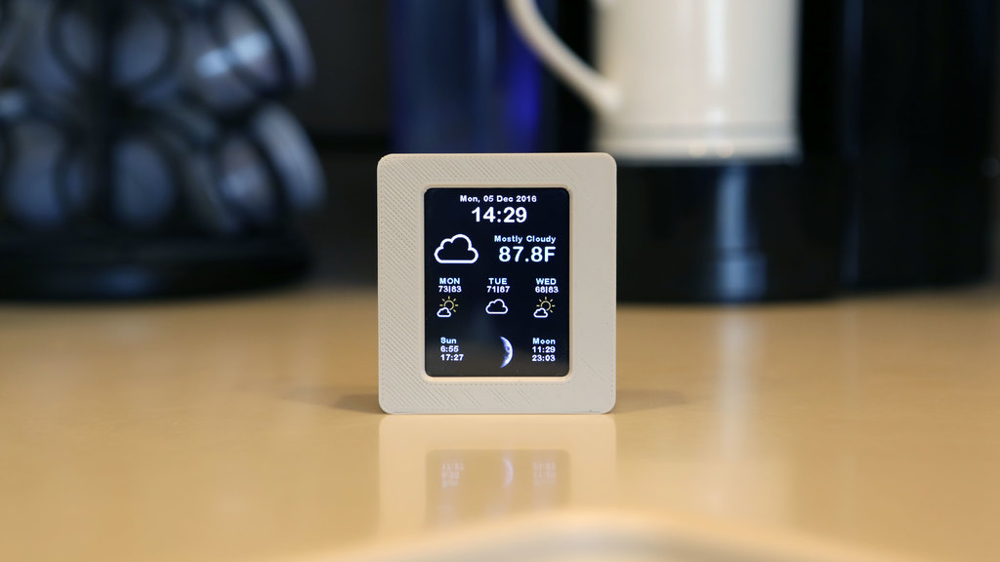
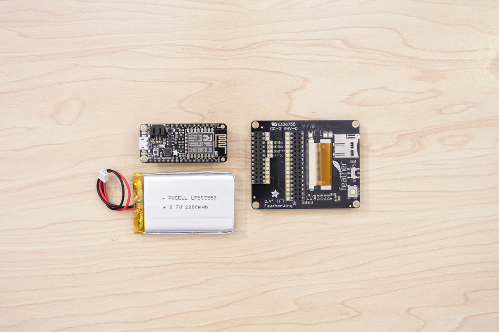

## WIFI WEATHER STATION



CLOUD Company is looking for a new wifi weather station product. This will allow to monitor and display weather conditions on a screen. It should display the date, time, current weather conditions, 4-day forecast and even moon phases.

The product should be affordable and easy to produce with digital fabrication technologies and processes, in order to have a retail value of 80 $ or less.

The technology stack will be based on Adafruit components and the Wunderground API
using an ESP8266 microcontroller and a 2.4" TFT touchscreen display. 
Designers should prototype a fancy shell for the product to embed the electronics.

The project should include the product concept statement and its documentation in order to easily replicate the product in any lab.

### PRODUCT REQUIREMENTS

- User friendly
- Attractive, with an hi-tech look suitable to be put on an office desk or in the house
- Easy to produce in any lab in 4 hours maximum
- Portable and lightweight

### MACHINES AND TOOLS

- 3D Printer
- Laser cutter
- Precision CNC Mill, i.e. Roland SRM-20 
- Soldering iron

### BILL OF MATERIALS

- 2.4" TFT Feather Wing 320x240 Touch screen
- Adafruit Feather HUZZAH with ESP8266 WiFi (http://adafru.it/2821)
- 2000mAh Rechargeable Battery  (http://adafru.it/2011) 
- Slide Switch (http://adafru.it/805) 
- ABS / PLA Filament
- Silicon for molding 
- Resin for casting
- Machinable wax

### Building instructions

The project is extremely easy to assemble thanks to the integrated boards of the Adafruit Feather series. 



You need to connect the display and attach the battery to complete the assembly. Optionally you can include a switch for disconnecting one of the battery wires when the device is off. 


### 3D Printing

You can start your design from these models on [Thingiverse](https://www.thingiverse.com/thing:1944905) or use the Fusion 360 design in the shared folder (IOT projects).


### Programming

Programming the board can be done with the Arduino IDE.

**Preparation**

You need to add support for the [Adafruit ESP8266 board](https://learn.adafruit.com/adafruit-feather-huzzah-esp8266/using-arduino-ide) and [Display / TouchScreen](https://learn.adafruit.com/adafruit-2-4-tft-touch-screen-featherwing) and install the required libraries in the Arduino IDE, either manually or using the Library manager:

- [Adafruit GFX Library](https://github.com/adafruit/Adafruit-GFX-Library)
- [Adafruit ILI9341 Library](https://github.com/adafruit/Adafruit_ILI9341)
- [Adafruit STMPE610](https://github.com/adafruit/Adafruit_STMPE610)
- [WiFiManager for ESP8266](https://github.com/tzapu/WiFiManager)
- [ESP8266 Weather Station Library](https://github.com/squix78/esp8266-weather-station)
- [JSON Streaming Parser](https://github.com/squix78/json-streaming-parser)

You will also need the free [Wunderground API Key](https://www.wunderground.com/weather/api/d/pricing.html) for the weather forecast API.

The Software sketch can be downloaded at the following git repository:

https://github.com/fablabmade/weather-station-color

Download the sketch and later upload it through the Arduino IDE. Before uploading update the `settings.h` file:

```
// Wunderground Settings
const boolean IS_METRIC = true;
const String WUNDERGRROUND_API_KEY = "68b21a1a4d573729";
const String WUNDERGRROUND_LANGUAGE = "EN";
const String WUNDERGROUND_COUNTRY = "UAE";
const String WUNDERGROUND_CITY = "Dubai";
```

You can replace the Key with your own received from Wunderground.

The software will put the device in sleep mode after 5s use. Touching the screen can wake up the device. This allows few hours of operation without recharging.

***References***

Project based on [ESP8266 Weather Station](https://learn.adafruit.com/wifi-weather-station-with-tft-display/overview) and Daniel Eichhorn @ http://blog.squix.ch